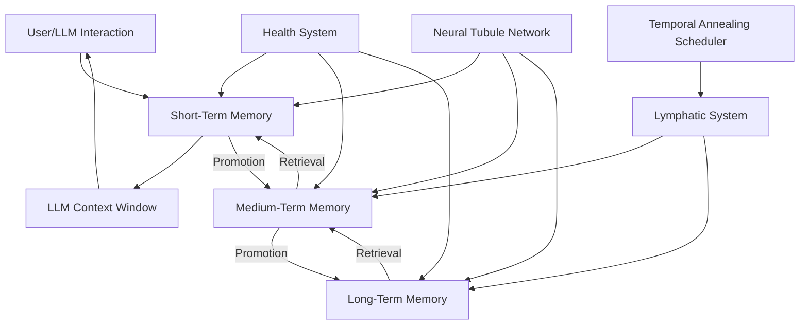

# NeuroCognitive Architecture (NCA) - Data Architecture

This document outlines the comprehensive data architecture for the NeuroCognitive Architecture (NCA) system, including data models, flows, storage solutions, security considerations, and scalability planning.

## Table of Contents
1. [Data Models and Schemas](#1-data-models-and-schemas)
2. [Data Flow Between Components](#2-data-flow-between-components)
3. [Data Storage Solutions](#3-data-storage-solutions)
4. [Data Security Considerations](#4-data-security-considerations)
5. [Data Scalability Planning](#5-data-scalability-planning)

## 1. Data Models and Schemas

### 1.1 Core Memory Entity

All memory tiers share a common base structure with tier-specific extensions:

```typescript
interface BaseMemory {
  id: string;                     // Unique identifier (UUID v4)
  content: string;                // The actual memory content
  embedding: number[];            // Vector representation (1536 dimensions for OpenAI embeddings)
  contentType: ContentType;       // Enum: TEXT, IMAGE_REFERENCE, AUDIO_REFERENCE, etc.
  createdAt: DateTime;            // Creation timestamp
  updatedAt: DateTime;            // Last update timestamp
  lastAccessedAt: DateTime;       // Last retrieval timestamp
  accessCount: number;            // Number of times retrieved
  
  // Health metadata
  baseHealthScore: number;        // 0-100 score
  relevanceScore: number;         // 0-100 score
  importanceFlag: number;         // 0-10 flag
  tags: string[];                 // Semantic tags for categorization
  
  // Source tracking
  source: MemorySource;           // Enum: USER_INPUT, LLM_OUTPUT, SYSTEM, etc.
  conversationId?: string;        // Reference to originating conversation
  
  // Relationship data
  relatedMemories: RelatedMemory[]; // References to connected memories
}

interface RelatedMemory {
  targetMemoryId: string;         // ID of the related memory
  relationshipType: RelationType; // Enum: PARENT, CHILD, SIMILAR, CONTRADICTS, etc.
  strength: number;               // 0-1 relationship strength
  createdAt: DateTime;            // When the relationship was established
  lastReinforced: DateTime;       // When the relationship was last accessed/strengthened
}
```

### 1.2 Short-Term Memory (STM) Schema

```typescript
interface STMemory extends BaseMemory {
  expiresAt: DateTime;            // When this memory will be evaluated for demotion/deletion
  priority: number;               // 0-100 priority for context inclusion
  contextWindow: string;          // Identifier for active context window
  isActive: boolean;              // Whether currently in use in active conversations
  
  // STM-specific fields
  recencyWeight: number;          // Higher weight for very recent memories
  volatilityFactor: number;       // How quickly health decays (higher than other tiers)
}
```

### 1.3 Medium-Term Memory (MTM) Schema

```typescript
interface MTMemory extends BaseMemory {
  // MTM-specific fields
  consolidationLevel: number;     // 0-100 indicating degree of processing/refinement
  abstractionScore: number;       // 0-100 indicating how abstract vs. specific
  lastConsolidatedAt: DateTime;   // When this memory was last processed by the lymphatic system
  promotionEligibility: number;   // 0-100 score for LTM promotion candidacy
  demotionRisk: number;           // 0-100 risk score for demotion to STM
  
  // Temporal context
  temporalReferences: TemporalReference[]; // Time-based relationships
}

interface TemporalReference {
  referenceType: TemporalReferenceType; // Enum: BEFORE, AFTER, DURING, etc.
  referenceValue: string;         // Description of temporal relationship
  confidence: number;             // 0-1 confidence in this temporal relationship
}
```

### 1.4 Long-Term Memory (LTM) Schema

```typescript
interface LTMemory extends BaseMemory {
  // LTM-specific fields
  stabilityScore: number;         // 0-100 indicating resistance to forgetting
  abstractionLevel: number;       // 0-100 indicating degree of abstraction
  episodicDetails: EpisodicDetail[]; // Specific instances that formed this memory
  semanticNetwork: SemanticNode[]; // Conceptual relationships
  lastReinforcedAt: DateTime;     // When this memory was last strengthened
  
  // Knowledge representation
  factuality: number;             // 0-1 confidence in factual accuracy
  domainCategories: string[];     // Knowledge domains this memory belongs to
  isCoreConcept: boolean;         // Whether this represents fundamental knowledge
}

interface EpisodicDetail {
  episodeId: string;              // Reference to specific episode/experience
  contributionStrength: number;   // 0-1 how strongly this episode contributed
  episodeTimestamp: DateTime;     // When the episode occurred
}

interface SemanticNode {
  concept: string;                // Related concept
  relationshipType: string;       // How concepts are related (e.g., "is-a", "has-part")
  strength: number;               // 0-1 relationship strength
}
```

### 1.5 Neural Tubule Network Schema

```typescript
interface NeuralTubule {
  id: string;                     // Unique identifier
  sourceMemoryId: string;         // Origin memory
  targetMemoryId: string;         // Destination memory
  tubuleType: TubuleType;         // Enum: SEMANTIC, EPISODIC, TEMPORAL, etc.
  strength: number;               // 0-1 connection strength
  createdAt: DateTime;            // When connection was first established
  lastActivatedAt: DateTime;      // When connection was last traversed
  activationCount: number;        // How often this connection has been used
  bidirectional: boolean;         // Whether connection works both ways
  
  // Dynamic properties
  decayRate: number;              // How quickly strength diminishes without use
  reinforcementRate: number;      // How quickly strength increases with use
}
```

### 1.6 Memory Health System Schema

```typescript
interface HealthMetadata {
  memoryId: string;               // Reference to the memory
  currentTier: MemoryTier;        // Enum: STM, MTM, LTM
  baseHealthScore: number;        // 0-100 composite health
  lastCalculatedAt: DateTime;     // When health was last computed
  
  // Health factors
  recencyFactor: number;          // Time-based decay component
  relevanceScore: number;         // Contextual relevance
  accessFrequency: number;        // Normalized access rate
  importanceFlag: number;         // Manual or derived importance
  
  // Tier transition data
  promotionThreshold: number;     // Score needed for promotion
  demotionThreshold: number;      // Score triggering demotion
  forgettingThreshold: number;    // Score triggering deletion
  
  // Health history for analysis
  healthHistory: HealthSnapshot[]; // Historical health records
}

interface HealthSnapshot {
  timestamp: DateTime;            // When snapshot was taken
  healthScore: number;            // Health at that time
  tier: MemoryTier;               // Memory tier at that time
  reason: string;                 // Context for this snapshot
}
```

### 1.7 Memory Lymphatic System Schema

```typescript
interface ConsolidationJob {
  id: string;                     // Unique job identifier
  status: JobStatus;              // Enum: PENDING, PROCESSING, COMPLETED, FAILED
  jobType: ConsolidationType;     // Enum: REDUNDANCY_CHECK, ABSTRACTION, REINFORCEMENT, etc.
  targetMemoryIds: string[];      // Memories to process
  priority: number;               // Job priority (0-100)
  scheduledFor: DateTime;         // When job should execute
  createdAt: DateTime;            // When job was created
  completedAt?: DateTime;         // When job finished
  
  // Processing metadata
  processingDuration?: number;    // Time taken in ms
  resourceConsumption?: ResourceMetrics; // CPU/memory usage
  resultSummary?: string;         // Human-readable outcome
  
  // Results
  memoriesCreated?: string[];     // New memories generated
  memoriesModified?: string[];    // Existing memories updated
  memoriesDeleted?: string[];     // Memories removed
}

interface ResourceMetrics {
  cpuTimeMs: number;              // CPU time consumed
  memoryBytesUsed: number;        // Memory consumed
  dbOperations: number;           // Database operations performed
}
```

### 1.8 Temporal Annealing Scheduler Schema

```typescript
interface AnnealingSchedule {
  id: string;                     // Schedule identifier
  scheduleType: ScheduleType;     // Enum: DAILY, WEEKLY, LOAD_BASED, etc.
  targetTier: MemoryTier;         // Which memory tier to process
  processingIntensity: number;    // 0-100 intensity level
  
  // Timing configuration
  startTime: DateTime;            // When to begin processing
  maxDuration: number;            // Maximum runtime in seconds
  cooldownPeriod: number;         // Minimum time between runs
  
  // Resource constraints
  maxCpuPercent: number;          // Maximum CPU utilization
  maxMemoryPercent: number;       // Maximum memory utilization
  
  // Adaptive parameters
  lastRunDuration: number;        // How long previous run took
  lastRunMemoriesProcessed: number; // How many memories were processed
  efficiencyScore: number;        // 0-100 score of processing efficiency
}
```

### 1.9 Integration Layer Schema

```typescript
interface LLMContext {
  id: string;                     // Context identifier
  llmProvider: string;            // Which LLM is being used
  maxTokens: number;              // Token limit for this context
  usedTokens: number;             // Tokens currently in use
  
  // Memory references
  activeMemories: ContextMemory[]; // Memories currently in context
  recentlyEvictedMemories: string[]; // Recently removed from context
  
  // Context management
  relevanceThreshold: number;     // Minimum relevance for inclusion
  recencyWeight: number;          // Importance of recency in selection
  importanceWeight: number;       // Importance of importance flag in selection
  
  // Performance tracking
  retrievalLatencyMs: number;     // Time spent retrieving memories
  injectionLatencyMs: number;     // Time spent injecting into context
}

interface ContextMemory {
  memoryId: string;               // Reference to memory
  contextRelevance: number;       // 0-1 relevance to current context
  tokenCount: number;             // Tokens consumed by this memory
  injectedAt: DateTime;           // When added to context
  source: ContextSource;          // How this memory was selected
}
```

## 2. Data Flow Between Components

### 2.1 Primary Data Flows



### 2.2 Memory Creation Flow

1. **Input Processing**:
   - User input or LLM output is captured
   - Content is analyzed for memory-worthy information
   - Embeddings are generated for semantic representation

2. **Initial Storage**:
   - New memory is created in Short-Term Memory (STM)
   - Health metadata is initialized with high recency factor
   - Initial relationships are established if possible

3. **Health Calculation**:
   - Base health score is computed from multiple factors
   - Relevance to current context is assessed
   - Importance is estimated based on content analysis

4. **Neural Tubule Creation**:
   - Semantic similarity search identifies related memories
   - Initial tubules are created with appropriate strength
   - Bidirectional connections are established where appropriate

### 2.3 Memory Retrieval Flow

1. **Query Formation**:
   - Context analysis extracts key concepts and entities
   - Query vector is generated from context embedding
   - Retrieval parameters are set based on context needs

2. **Multi-Tier Search**:
   - STM is searched first with strict relevance threshold
   - If insufficient results, MTM is searched next
   - Finally, LTM is searched if needed

3. **Result Ranking**:
   - Results are ranked by composite score:
     - Semantic relevance to query
     - Health score
     - Recency factor
     - Importance flag

4. **Context Integration**:
   - Top-ranked memories are selected within token budget
   - Memories are formatted for context injection
   - Metadata is updated (access count, last accessed)

5. **Health Update**:
   - Retrieved memories receive health boost
   - Neural tubules along retrieval path are strengthened
   - Access frequency counters are incremented

### 2.4 Memory Consolidation Flow

1. **Job Scheduling**:
   - Annealing scheduler determines processing windows
   - Consolidation jobs are created with appropriate parameters
   - Resource constraints are established

2. **Candidate Selection**:
   - Memories are selected based on consolidation criteria
   - Selection prioritizes high-value consolidation opportunities
   - Batch size is optimized for processing efficiency

3. **Processing Pipeline**:
   - Redundancy detection identifies similar memories
   - Abstraction processes extract higher-level concepts
   - Relationship reinforcement strengthens important connections

4. **Result Integration**:
   - New abstract memories are created in higher tiers
   - Existing memories are updated with new relationships
   - Redundant or low-value memories are marked for removal

5. **Health Recalculation**:
   - Health scores are updated based on consolidation results
   - Promotion/demotion decisions are made
   - Forgetting is applied to memories below threshold

### 2.5 Tier Transition Flow

1. **Promotion Process** (Lower to Higher Tier):
   - Health exceeds promotion threshold for sustained period
   - Memory is evaluated for higher-tier compatibility
   - Content is processed for appropriate abstraction level
   - New tier-specific attributes are initialized
   - Original lower-tier memory may be preserved or removed

2. **Demotion Process** (Higher to Lower Tier):
   - Health falls below demotion threshold
   - Memory is evaluated for continued relevance
   - Content is reformatted for lower-tier storage
   - Relationships are preserved where possible
   - Higher-tier specific attributes are archived

## 3. Data Storage Solutions

### 3.1 Short-Term Memory (STM) Storage

**Primary Technology: Redis**

```yaml
Implementation:
  database: Redis
  dataStructure: Hash + RedisJSON + RediSearch
  indexing: Vector search (HNSW algorithm)
  persistence: RDB snapshots (15-minute intervals)
  replication: Master-replica with async replication
  
Configuration:
  maxmemory: 75% of available RAM
  maxmemory-policy: volatile-ttl
  eviction-policy: Custom health-based eviction
  
Performance Targets:
  averageLatency: <10ms for retrieval
  throughput: >1000 operations/second
  maxItems: ~100,000 memories per instance
  
Optimization:
  caching: In-memory with no additional caching
  compression: LZ4 for large text fields
  partitioning: Hash-based sharding for multi-node deployments
```

**Schema Implementation (Redis)**:

```
# Memory object stored as RedisJSON
memory:{id} = {
  "id": "mem_123abc",
  "content": "User expressed interest in machine learning applications",
  "embedding": [0.1, 0.2, ...],  # Vector data
  "contentType": "TEXT",
  "createdAt": "2023-06-15T14:30:00Z",
  # Additional fields from STMemory interface
}

# Index for vector search
FT.CREATE memory_idx ON JSON PREFIX 1 memory: SCHEMA 
  $.embedding AS embedding VECTOR HNSW 6 TYPE FLOAT32 DIM 1536 DISTANCE_METRIC COSINE
  $.content AS content TEXT
  $.tags.* AS tags TAG
  $.baseHealthScore AS health NUMERIC
  $.expiresAt AS expires NUMERIC
```

### 3.2 Medium-Term Memory (MTM) Storage

**Primary Technology: MongoDB with Atlas Vector Search**

```yaml
Implementation:
  database: MongoDB
  collection: medium_term_memories
  indexing: 
    - Atlas Vector Search for embeddings
    - B-tree indexes for metadata fields
    - Compound indexes for common query patterns
  sharding: Hash-based on memory ID
  
Configuration:
  writeConcern: "majority"
  readConcern: "local"
  readPreference: "primaryPreferred"
  
Performance Targets:
  averageLatency: <50ms for retrieval
  throughput: >500 operations/second
  maxItems: ~1,000,000 memories per cluster
  
Optimization:
  caching: Application-level caching with TTL
  compression: zstd compression for storage
  indexing: Covered queries for common patterns
```

**Schema Implementation (MongoDB)**:

```javascript
// Collection: medium_term_memories
{
  "_id": ObjectId("..."),
  "memoryId": "mem_456def",
  "content": "User has consistently shown interest in machine learning, particularly in NLP applications and transformer models",
  "embedding": [0.1, 0.2, ...],  // Vector data
  "contentType": "TEXT",
  "createdAt": ISODate("2023-06-10T09:15:00Z"),
  "updatedAt": ISODate("2023-06-15T14:35:00Z"),
  "lastAccessedAt": ISODate("2023-06-15T14:35:00Z"),
  "accessCount": 12,
  
  // Health metadata
  "baseHealthScore": 78,
  "relevanceScore": 85,
  "importanceFlag": 6,
  "tags": ["machine_learning", "nlp", "user_interest"],
  
  // MTM-specific fields
  "consolidationLevel": 65,
  "abstractionScore": 40,
  "lastConsolidatedAt": ISODate("2023-06-14T02:15:00Z"),
  "promotionEligibility": 58,
  "demotionRisk": 15,
  
  // Relationships
  "relatedMemories": [
    {
      "targetMemoryId": "mem_789ghi",
      "relationshipType": "SIMILAR",
      "strength": 0.85,
      "createdAt": ISODate("2023-06-12T10:30:00Z"),
      "lastReinforced": ISODate("2023-06-15T14:35:00Z")
    }
  ],
  
  // Temporal context
  "temporalReferences": [
    {
      "referenceType": "AFTER",
      "referenceValue": "Initial discussion about AI capabilities",
      "confidence": 0.9
    }
  ]
}
```

**Vector Search Index**:

```javascript
{
  "mappings": {
    "dynamic": true,
    "fields": {
      "embedding": {
        "dimensions": 1536,
        "similarity": "cosine",
        "type": "knnVector"
      }
    }
  }
}
```

### 3.3 Long-Term Memory (LTM) Storage

**Primary Technology: PostgreSQL with pgvector**

```yaml
Implementation:
  database: PostgreSQL 15+
  extensions: 
    - pgvector for vector operations
    - pg_cron for scheduled maintenance
    - pg_partman for table partitioning
  indexing:
    - HNSW index for embeddings
    - B-tree for standard fields
    - GIN for array and JSONB fields
  
Configuration:
  wal_level: logical
  max_wal_senders: 10
  shared_buffers: 25% of RAM
  effective_cache_size: 75% of RAM
  
Performance Targets:
  averageLatency: <200ms for retrieval
  throughput: >200 operations/second
  maxItems: ~10,000,000 memories per cluster
  
Optimization:
  partitioning: Range partitioning by creation date
  vacuuming: Aggressive autovacuum for high-churn tables
  caching: Application-level caching with invalidation
```

**Schema Implementation (PostgreSQL)**:

```sql
-- Extension setup
CREATE EXTENSION IF NOT EXISTS vector;
CREATE EXTENSION IF NOT EXISTS pg_cron;

-- Main memory table
CREATE TABLE long_term_memories (
    id UUID PRIMARY KEY,
    memory_id VARCHAR(64) UNIQUE NOT NULL,
    content TEXT NOT NULL,
    embedding VECTOR(1536) NOT NULL,
    content_type VARCHAR(20) NOT NULL,
    created_at TIMESTAMP WITH TIME ZONE NOT NULL,
    updated_at TIMESTAMP WITH TIME ZONE NOT NULL,
    last_accessed_at TIMESTAMP WITH TIME ZONE NOT NULL,
    access_count INTEGER NOT NULL DEFAULT 0,
    
    -- Health metadata
    base_health_score SMALLINT NOT NULL CHECK (base_health_score BETWEEN 0 AND 100),
    relevance_score SMALLINT NOT NULL CHECK (relevance_score BETWEEN 0 AND 100),
    importance_flag SMALLINT NOT NULL CHECK (importance_flag BETWEEN 0 AND 10),
    tags TEXT[] NOT NULL DEFAULT '{}',
    
    -- LTM-specific fields
    stability_score SMALLINT NOT NULL CHECK (stability_score BETWEEN 0 AND 100),
    abstraction_level SMALLINT NOT NULL CHECK (abstraction_level BETWEEN 0 AND 100),
    last_reinforced_at TIMESTAMP WITH TIME ZONE,
    factuality REAL NOT NULL CHECK (factuality BETWEEN 0 AND 1),
    domain_categories TEXT[] NOT NULL DEFAULT '{}',
    is_core_concept BOOLEAN NOT NULL DEFAULT FALSE,
    
    -- Additional metadata as JSONB for flexibility
    metadata JSONB NOT NULL DEFAULT '{}'
);

-- Relationships table
CREATE TABLE memory_relationships (
    id UUID PRIMARY KEY,
    source_memory_id VARCHAR(64) NOT NULL REFERENCES long_term_memories(memory_id),
    target_memory_id VARCHAR(64) NOT NULL REFERENCES long_term_memories(memory_id),
    relationship_type VARCHAR(30) NOT NULL,
    strength REAL NOT NULL CHECK (strength BETWEEN 0 AND 1),
    created_at TIMESTAMP WITH TIME ZONE NOT NULL,
    last_reinforced_at TIMESTAMP WITH TIME ZONE NOT NULL,
    
    UNIQUE(source_memory_id, target_memory_id, relationship_type)
);

-- Episodic details table
CREATE TABLE episodic_details (
    id UUID PRIMARY KEY,
    memory_id VARCHAR(64) NOT NULL REFERENCES long_term_memories(memory_id),
    episode_id VARCHAR(64) NOT NULL,
    contribution_strength REAL NOT NULL CHECK (contribution_strength BETWEEN 0 AND 1),
    episode_timestamp TIMESTAMP WITH TIME ZONE NOT NULL,
    
    UNIQUE(memory_id, episode_id)
);

-- Semantic network table
CREATE TABLE semantic_nodes (
    id UUID PRIMARY KEY,
    memory_id VARCHAR(64) NOT NULL REFERENCES long_term_memories(memory_id),
    concept VARCHAR(100) NOT NULL,
    relationship_type VARCHAR(30) NOT NULL,
    strength REAL NOT NULL CHECK (strength BETWEEN 0 AND 1),
    
    UNIQUE(memory_id, concept, relationship_type)
);

-- Indexes
CREATE INDEX ON long_term_memories USING GIN(tags);
CREATE INDEX ON long_term_memories USING GIN(domain_categories);
CREATE INDEX ON long_term_memories(base_health_score);
CREATE INDEX ON long_term_memories(last_accessed_at);
CREATE INDEX ON long_term_memories(abstraction_level);
CREATE INDEX ON memory_relationships(source_memory_id);
CREATE INDEX ON memory_relationships(target_memory_id);
CREATE INDEX ON memory_relationships(relationship_type);

-- Vector index
CREATE INDEX ON long_term_memories USING hnsw (embedding vector_cosine_ops);
```

### 3.4 Neural Tubule Network Storage

**Primary Technology: Neo4j Graph Database**

```yaml
Implementation:
  database: Neo4j Enterprise
  model: Property Graph
  indexing:
    - B-tree for node properties
    - Full-text search for content
  
Configuration:
  dbms.memory.heap.initial_size: 4G
  dbms.memory.heap.max_size: 16G
  dbms.memory.pagecache.size: 8G
  
Performance Targets:
  averageLatency: <100ms for path traversal
  throughput: >300 operations/second
  maxItems: ~50,000,000 relationships
  
Optimization:
  caching: Neo4j page cache
  query optimization: Stored procedures for common patterns
  batching: Batch updates for relationship modifications
```

**Schema Implementation (Neo4j Cypher)**:

```cypher
// Node definitions
CREATE CONSTRAINT memory_id IF NOT EXISTS ON (m:Memory) ASSERT m.memoryId IS UNIQUE;

// Memory nodes
CREATE (m:Memory {
  memoryId: "mem_123abc",
  tier: "STM",
  content: "User expressed interest in machine learning applications",
  contentType: "TEXT",
  createdAt: datetime("2023-06-15T14:30:00Z"),
  baseHealthScore: 85,
  // Other properties from memory schema
});

// Tubule relationships
MATCH (source:Memory {memoryId: "mem_123abc"})
MATCH (target:Memory {memoryId: "mem_456def"})
CREATE (source)-[t:TUBULE {
  tubuleId: "tub_789xyz",
  tubuleType: "SEMANTIC",
  strength: 0.75,
  createdAt: datetime("2023-06-15T14:35:00Z"),
  lastActivatedAt: datetime("2023-06-15T14:35:00Z"),
  activationCount: 1,
  bidirectional: true,
  decayRate: 0.01,
  reinforcementRate: 0.05
}]->(target);

// Indexes for performance
CREATE INDEX memory_content_idx IF NOT EXISTS FOR (m:Memory) ON (m.content);
CREATE INDEX memory_health_idx IF NOT EXISTS FOR (m:Memory) ON (m.baseHealthScore);
CREATE INDEX tubule_strength_idx IF NOT EXISTS FOR ()-[t:TUBULE]-() ON (t.strength);
```

### 3.5 Memory Health System Storage

**Primary Technology: TimescaleDB (PostgreSQL extension)**

```yaml
Implementation:
  database: PostgreSQL with TimescaleDB
  tables:
    - health_current: Current health state
    - health_history: Time-series health data
  indexing:
    - TimescaleDB hypertables for time-series data
    - B-tree for standard queries
  
Configuration:
  timescaledb.max_background_workers: 8
  
Performance Targets:
  averageLatency: <50ms for current health, <200ms for historical
  throughput: >500 operations/second
  retention: 90 days for detailed history, aggregated beyond
  
Optimization:
  compression: TimescaleDB native compression
  partitioning: Automatic time-based partitioning
  aggregation: Continuous aggregates for analytics
```

**Schema Implementation (TimescaleDB/PostgreSQL)**:

```sql
-- Extension setup
CREATE EXTENSION IF NOT EXISTS timescaledb;

-- Current health state
CREATE TABLE health_current (
    memory_id VARCHAR(64) PRIMARY KEY,
    current_tier VARCHAR(3) NOT NULL CHECK (current_tier IN ('STM', 'MTM', 'LTM')),
    base_health_score SMALLINT NOT NULL CHECK (base_health_score BETWEEN 0 AND 100),
    last_calculated_at TIMESTAMP WITH TIME ZONE NOT NULL,
    
    -- Health factors
    recency_factor REAL NOT NULL CHECK (recency_factor BETWEEN 0 AND 1),
    relevance_score SMALLINT NOT NULL CHECK (relevance_score BETWEEN 0 AND 100),
    access_frequency REAL NOT NULL,
    importance_flag SMALLINT NOT NULL CHECK (importance_flag BETWEEN 0 AND 10),
    
    -- Tier transition data
    promotion_threshold SMALLINT NOT NULL CHECK (promotion_threshold BETWEEN 0 AND 100),
    demotion_threshold SMALLINT NOT NULL CHECK (demotion_threshold BETWEEN 0 AND 100),
    forgetting_threshold SMALLINT NOT NULL CHECK (forgetting_threshold BETWEEN 0 AND 100)
);

-- Health history as time series
CREATE TABLE health_history (
    id BIGSERIAL PRIMARY KEY,
    memory_id VARCHAR(64) NOT NULL,
    timestamp TIMESTAMP WITH TIME ZONE NOT NULL,
    health_score SMALLINT NOT NULL CHECK (health_score BETWEEN 0 AND 100),
    tier VARCHAR(3) NOT NULL CHECK (tier IN ('STM', 'MTM', 'LTM')),
    reason VARCHAR(100),
    
    -- Additional metrics
    recency_factor REAL,
    relevance_score SMALLINT,
    access_frequency REAL,
    importance_flag SMALLINT
);

-- Convert to hypertable
SELECT create_hypertable('health_history', 'timestamp');

-- Indexes
CREATE INDEX ON health_current(current_tier, base_health_score);
CREATE INDEX ON health_history(memory_id, timestamp DESC);

-- Continuous aggregate for daily health trends
CREATE MATERIALIZED VIEW health_daily_trends
WITH (timescaledb.continuous) AS
SELECT
    time_bucket('1 day', timestamp) AS day,
    memory_id,
    tier,
    AVG(health_score) AS avg_health,
    MIN(health_score) AS min_health,
    MAX(health_score) AS max_health,
    COUNT(*) AS update_count
FROM health_history
GROUP BY day, memory_id, tier;

-- Retention policy
SELECT add_retention_policy('health_history', INTERVAL '90 days');
```

### 3.6 Memory Lymphatic System Storage

**Primary Technology: RabbitMQ + MongoDB**

```yaml
Implementation:
  messageQueue: RabbitMQ
  database: MongoDB
  collections:
    - consolidation_jobs
    - consolidation_results
  
Configuration:
  rabbitmq:
    prefetch: 10
    durability: true
    acknowledgment: manual
  mongodb:
    writeConcern: "majority"
    readConcern: "local"
  
Performance Targets:
  jobThroughput: >100 jobs/minute
  averageJobLatency: <5 seconds
  peakLoad: 1000 concurrent jobs
  
Optimization:
  priorityQueues: Multiple priority levels
  batchProcessing: Group similar jobs
  resultCaching: Cache recent consolidation results
```

**Schema Implementation (MongoDB for job storage)**:

```javascript
// Collection: consolidation_jobs
{
  "_id": ObjectId("..."),
  "jobId": "job_123abc",
  "status": "PENDING",
  "jobType": "REDUNDANCY_CHECK",
  "targetMemoryIds": ["mem_123abc", "mem_456def"],
  "priority": 75,
  "scheduledFor": ISODate("2023-06-16T02:00:00Z"),
  "createdAt": ISODate("2023-06-15T14:40:00Z"),
  
  // Job parameters
  "parameters": {
    "similarityThreshold": 0.85,
    "maxMergeCount": 5,
    "preserveOriginals": false
  },
  
  // Resource limits
  "maxRuntime": 300,  // seconds
  "maxMemoryMB": 512
}

// Collection: consolidation_results
{
  "_id": ObjectId("..."),
  "jobId": "job_123abc",
  "status": "COMPLETED",
  "startedAt": ISODate("2023-06-16T02:00:05Z"),
  "completedAt": ISODate("2023-06-16T02:00:35Z"),
  "processingDuration": 30000,  // ms
  
  "resourceConsumption": {
    "cpuTimeMs": 25000,
    "memoryBytesUsed": 128000000,
    "dbOperations": 42
  },
  
  "resultSummary": "Merged 3 similar memories about machine learning interests",
  
  "memoriesCreated": ["mem_789ghi"],
  "memoriesModified": ["mem_123abc"],
  "memoriesDeleted": ["mem_456def"]
}
```

### 3.7 Temporal Annealing Scheduler Storage

**Primary Technology: PostgreSQL with pg_cron**

```yaml
Implementation:
  database: PostgreSQL
  extensions: pg_cron
  tables:
    - annealing_schedules
    - annealing_runs
  
Configuration:
  cron.database_name: nca_system
  max_worker_processes: 10
  
Performance Targets:
  schedulingPrecision: <1 second
  maxConcurrentJobs: 5
  schedulingOverhead: <100ms
  
Optimization:
  adaptiveScheduling: Adjust based on system load
  resourceMonitoring: Track resource usage per schedule
  failureRecovery: Automatic retry with backoff
```

**Schema Implementation (PostgreSQL)**:

```sql
-- Extension setup
CREATE EXTENSION IF NOT EXISTS pg_cron;

-- Schedules table
CREATE TABLE annealing_schedules (
    id UUID PRIMARY KEY,
    schedule_type VARCHAR(20) NOT NULL,
    target_tier VARCHAR(3) NOT NULL CHECK (target_tier IN ('STM', 'MTM', 'LTM')),
    processing_intensity SMALLINT NOT NULL CHECK (processing_intensity BETWEEN 0 AND 100),
    
    -- Timing configuration
    cron_expression VARCHAR(100),  -- Standard cron format
    start_time TIME,
    max_duration INTEGER NOT NULL,  -- seconds
    cooldown_period INTEGER NOT NULL,  -- seconds
    
    -- Resource constraints
    max_cpu_percent SMALLINT NOT NULL CHECK (max_cpu_percent BETWEEN 1 AND 100),
    max_memory_percent SMALLINT NOT NULL CHECK (max_memory_percent BETWEEN 1 AND 100),
    
    -- Adaptive parameters
    last_run_duration INTEGER,
    last_run_memories_processed INTEGER,
    efficiency_score SMALLINT CHECK (efficiency_score BETWEEN 0 AND 100),
    
    -- Status
    is_active BOOLEAN NOT NULL DEFAULT TRUE,
    last_run_at TIMESTAMP WITH TIME ZONE,
    next_run_at TIMESTAMP WITH TIME ZONE
);

-- Run history
CREATE TABLE annealing_runs (
    id UUID PRIMARY KEY,
    schedule_id UUID NOT NULL REFERENCES annealing_schedules(id),
    start_time TIMESTAMP WITH TIME ZONE NOT NULL,
    end_time TIMESTAMP WITH TIME ZONE,
    status VARCHAR(20) NOT NULL,
    
    -- Performance metrics
    duration_seconds INTEGER,
    memories_processed INTEGER,
    cpu_percent_avg REAL,
    memory_percent_avg REAL,
    
    -- Results
    jobs_created INTEGER,
    success_rate REAL,
    notes TEXT
);

-- Indexes
CREATE INDEX ON annealing_schedules(next_run_at) WHERE is_active = TRUE;
CREATE INDEX ON annealing_runs(schedule_id, start_time DESC);
```

## 4. Data Security Considerations

### 4.1 Authentication and Authorization

```yaml
Authentication:
  method: OAuth 2.0 + JWT
  tokenLifetime: 1 hour for access tokens
  refreshTokenLifetime: 7 days
  mfaSupport: Optional TOTP
  
Authorization:
  model: Role-Based Access Control (RBAC)
  roles:
    - system_admin: Full system access
    - memory_manager: Can manage memories but not system config
    - memory_reader: Read-only access to memories
    - integration_service: API access for LLM integration
  
  permissions:
    - memory:read
    - memory:write
    - memory:delete
    - health:read
    - health:modify
    - system:configure
    - system:monitor
```

### 4.2 Data Encryption

```yaml
AtRest:
  method: AES-256-GCM
  keyManagement: AWS KMS or equivalent
  rotationPolicy: 90 days
  
InTransit:
  method: TLS 1.3
  minimumStrength: 128-bit
  preferredCipherSuites:
    - TLS_AES_256_GCM_SHA384
    - TLS_CHACHA20_POLY1305_SHA256
  
ApplicationLevel:
  sensitiveFields:
    - user_identifiers
    - personal_information
  method: Field-level encryption
  keyDerivation: PBKDF2 with high iteration count
```

### 4.3 Data Anonymization and Privacy

```yaml
PrivacyControls:
  PII:
    detection: Automated scanning with ML models
    handling: Tokenization or encryption
    retention: Configurable expiration
    
  Anonymization:
    method: Differential privacy for aggregated data
    noiseLevel: Configurable epsilon value
    minimumGroupSize: 5 for any aggregation
    
  AccessControl:
    memoryIsolation: Tenant-based separation
    crossTenantAccess: Explicitly prohibited
    auditLogging: All access to sensitive data
```

### 4.4 Audit and Compliance

```yaml
AuditTrail:
  coverage:
    - All authentication events
    - All authorization decisions
    - All memory CRUD operations
    - All system configuration changes
  
  retention: 1 year
  
  fields:
    - timestamp
    - actor
    - action
    - resource
    - result
    - client_ip
    - request_id
  
ComplianceFeatures:
  gdprSupport:
    - Right to access
    - Right to be forgotten
    - Data portability
  
  dataResidency:
    - Configurable storage location
    - Cross-border transfer controls
  
  certificationSupport:
    - SOC2
    - ISO 27001
    - HIPAA (with appropriate configuration)
```

### 4.5 Secure Development Practices

```yaml
SecureDevelopment:
  codeReview: Mandatory peer review for all changes
  staticAnalysis: Automated scanning for vulnerabilities
  dependencyScanning: Regular checks for vulnerable dependencies
  
  secretsManagement:
    - No hardcoded secrets
    - Vault or equivalent for secret storage
    - Automatic secret rotation
  
  containerSecurity:
    - Minimal base images
    - No running as root
    - Image scanning before deployment
```

## 5. Data Scalability Planning

### 5.1 Horizontal Scaling Strategy

```yaml
ShortTermMemory:
  scalingMechanism: Redis Cluster
  shardingStrategy: Hash slots (16384 slots)
  rebalancing: Automatic with manual approval
  growthModel: Add nodes when memory utilization exceeds 70%
  
MediumTermMemory:
  scalingMechanism: MongoDB sharded cluster
  shardingKey: Compound (creation date + memory ID)
  chunkSize: 64MB
  balancingWindow: 2am-5am daily
  
LongTermMemory:
  scalingMechanism: PostgreSQL with Citus extension
  distributionColumn: memory_id
  replicationFactor: 2
  readScaling: Read replicas with connection pooling
```

### 5.2 Vertical Scaling Considerations

```yaml
ResourceAllocation:
  cpu:
    STM: High priority, minimum 4 cores
    MTM: Medium priority, minimum 8 cores
    LTM: Lower priority, minimum 16 cores
  
  memory:
    STM: 90% in-memory operation, minimum 16GB
    MTM: Cache-heavy, minimum 32GB
    LTM: Index-focused, minimum 64GB
  
  storage:
    STM: High-speed SSD, minimum 100GB
    MTM: SSD, minimum 1TB
    LTM: Mixed SSD/HDD, minimum 10TB
  
UpgradeStrategy:
  - Monitor resource utilization trends
  - Upgrade when sustained utilization exceeds 70%
  - Perform upgrades during maintenance windows
  - Use blue/green deployment for zero-downtime upgrades
```

### 5.3 Data Partitioning and Sharding

```yaml
PartitioningStrategy:
  STM:
    method: In-memory segmentation
    key: Hash of memory ID
    segments: 16 per node
  
  MTM:
    method: Range-based sharding
    key: Creation timestamp
    ranges: Monthly partitions
    archiving: Move to cold storage after 6 months
  
  LTM:
    method: Multi-level partitioning
    primaryPartition: Creation year
    secondaryPartition: Domain category
    tertiaryPartition: Hash of memory ID
```

### 5.4 Caching Strategy

```yaml
CachingLayers:
  L1:
    technology: Application memory
    scope: Current session memories
    size: 100MB per session
    evictionPolicy: LRU
  
  L2:
    technology: Redis
    scope: Frequently accessed memories
    size: 25% of total memory volume
    ttl: 1 hour
  
  L3:
    technology: CDN (for static, shareable memories)
    scope: Common knowledge representations
    refreshPolicy: Daily or on update
```

### 5.5 Load Balancing and High Availability

```yaml
LoadBalancing:
  method: Layer 7 (Application)
  algorithm: Least connections with health checks
  sessionAffinity: Consistent hashing
  
HighAvailability:
  replicationStrategy:
    STM: Redis sentinel with automatic failover
    MTM: MongoDB replica sets (3 nodes minimum)
    LTM: PostgreSQL streaming replication
  
  recoveryTimeObjective: <30 seconds
  
  geographicDistribution:
    primary: Main deployment region
    secondary: Disaster recovery region
    synchronization: Semi-synchronous with validation
```

### 5.6 Capacity Planning

```yaml
GrowthProjections:
  memoryCreationRate: ~1000/day initially, growing 15% monthly
  totalStorageNeeds:
    year1: 5TB
    year2: 20TB
    year3: 50TB
  
  queryLoadProjection:
    initialQPS: 50
    year1Peak: 200
    year2Peak: 500
    year3Peak: 1000
  
ScalingTriggers:
  - CPU sustained >70% for 30 minutes
  - Memory usage >80% for 15 minutes
  - Storage usage >75%
  - Query latency increase >50% from baseline
  - Error rate >0.1% over 5-minute period
```

This comprehensive data architecture provides a solid foundation for implementing the NeuroCognitive Architecture (NCA) system, with careful consideration of data models, flows, storage solutions, security, and scalability. The design balances performance requirements with maintainability and security, while providing flexibility for future enhancements.